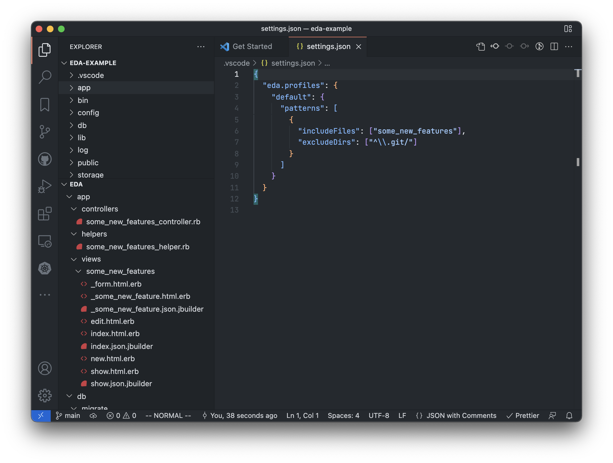

# Eda

Eda is an extension for VS Code to focus files in Explorer view.

If your project contains a large number of files, it will be difficult to find certain files from Explorer view. Eda limits shown files and it will be easier to find files.



## Basic Usage

### Option 1. Add exact files

1. Right-click on a file in Explorer view
2. Click `Eda: Add a file`
3. The file will appear Eda tree in Explorer view.

### Option 2. Filter files by regular expression

1. Open workspace settings in JSON
    1. Command Palette (Ctrl(Cmd)-Shift-P) > `Preferences: Open Workspace Settings (JSON)`
2. Add patterns to `eda.profiles` as follows.

```json
"eda.profiles": {
  "default": {
    "patterns": [
      {
        // includeFiles, excludeDirs and excludeFiles match against relative path.

        // Files matching includeFiles will appear in Eda tree
        "includeFiles": ["\\.ts$"],
        // Files under directories matching excludeDirs will not appear in Eda tree.
        // If your project contains a large number of files and it takes slow to scan files, this option helps you.
        "excludeDirs": ["^\\.git/", "^node_modules/"],
        // Files matching excludeFiles will not appear in Eda tree.
        "excludeFiles": ["\\.d\\.ts$"]
      }
    ]
  }
}
```

## Profiles

Eda supports multiple profiles to switch filtered files.

### Create a Profile

1. Open Command Palette (Ctrl(Cmd)-Shift-P)
2. Select `Create a New Profile`
3. Input new profile name, then press enter

### Switch Profile

1. Open Command Palette (Ctrl(Cmd)-Shift-P)
2. Select `Switch Profile`
